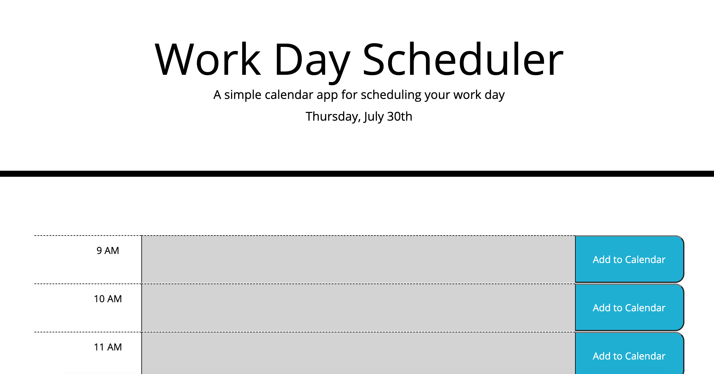
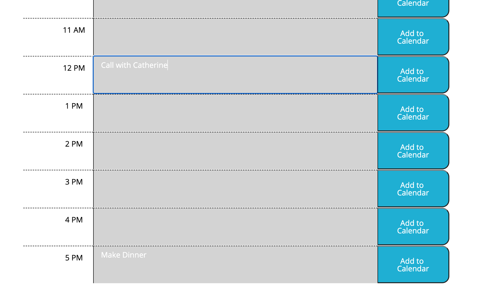
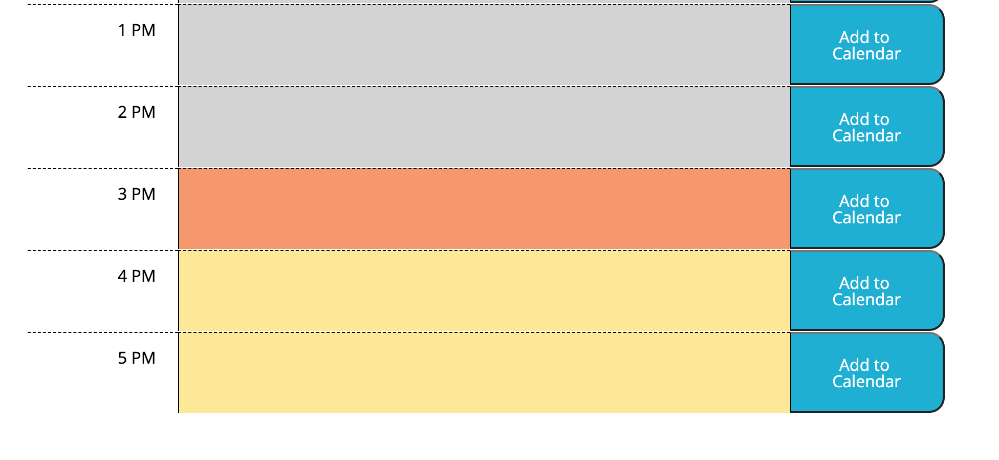

# Work Day Schedule

Created by me: *Danielle Hillman*
Link to deployed application: https://daniellehillman.github.io/workdayschedule

## The Daily Planner 
Under the description of the scheduler, the current date is displayed.

This planner is broken down by hour from 9-5pm. For each hour, the user can enter in any content to add to their calendar. After pushing 'Add to Calendar', the content is stored in local storage and will remain on the page after being refreshed. 

## Color Blocking 

Depending on the hour of the day, the color of each block will change. If the hour has past, the time block will be gray. If it is the current hour, the block will be orange. Lastly, hours in the future will be yellow. 

## Future Updating & Additions
Adding lists or rows into each hour time block could allow the user to enter in content in a helpful way. This could be an added tool to this application in the future.